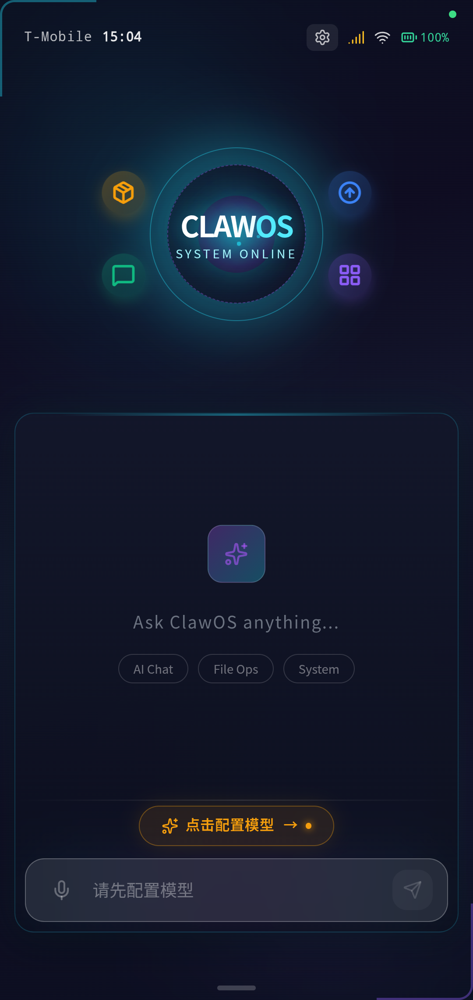
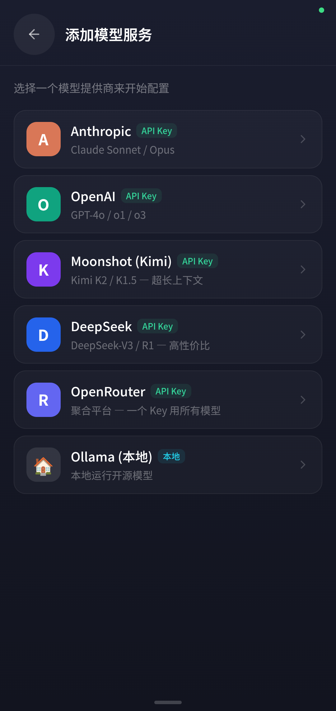
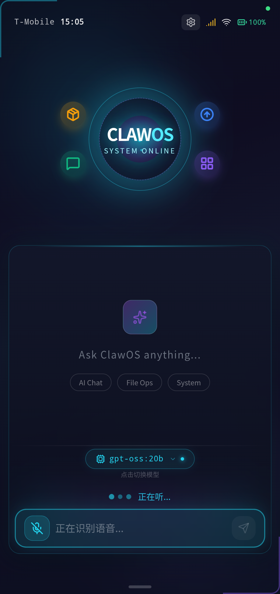
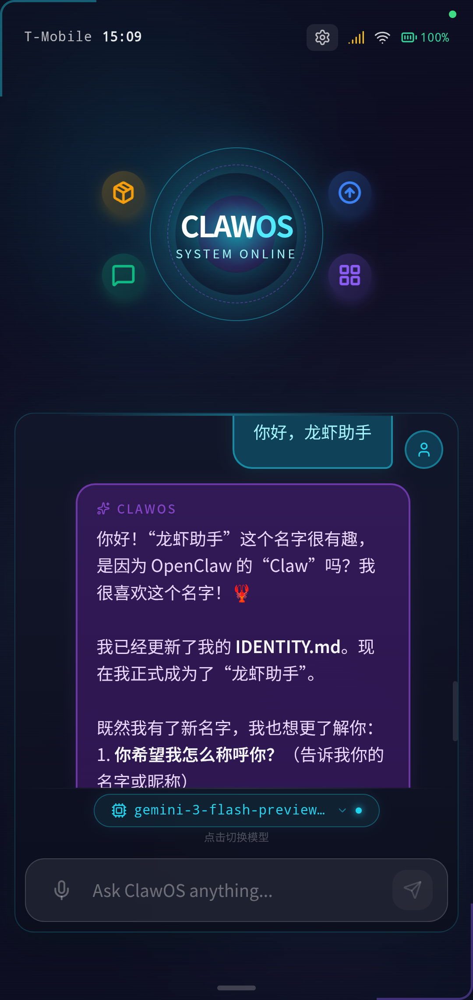
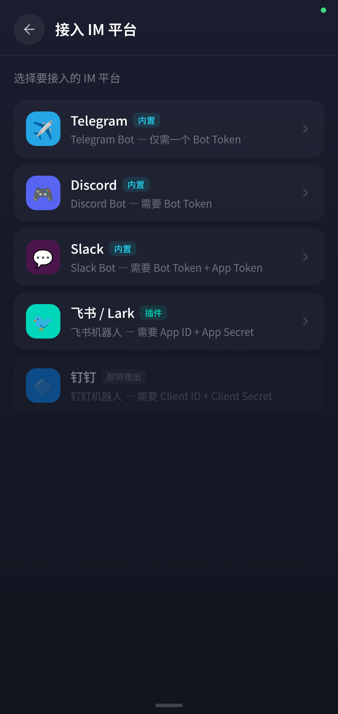
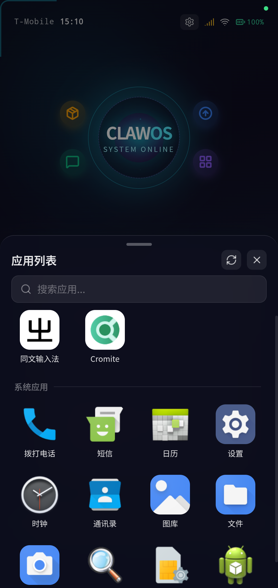
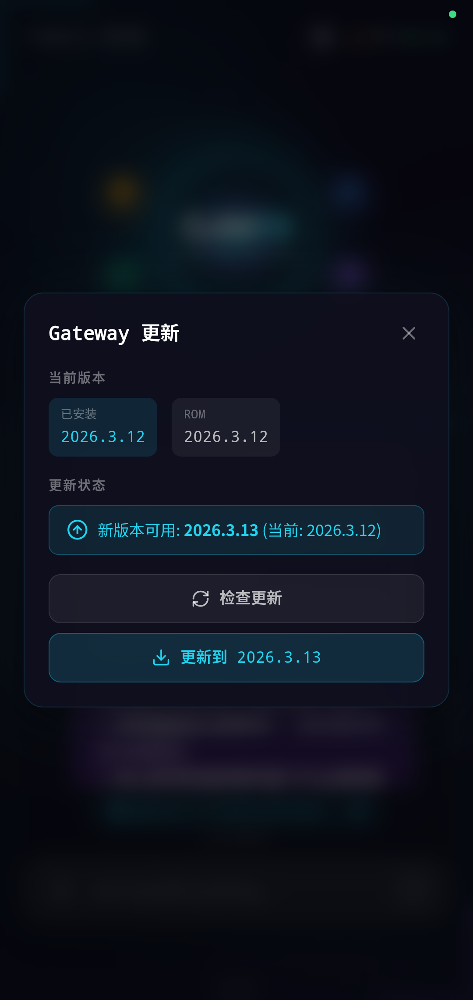
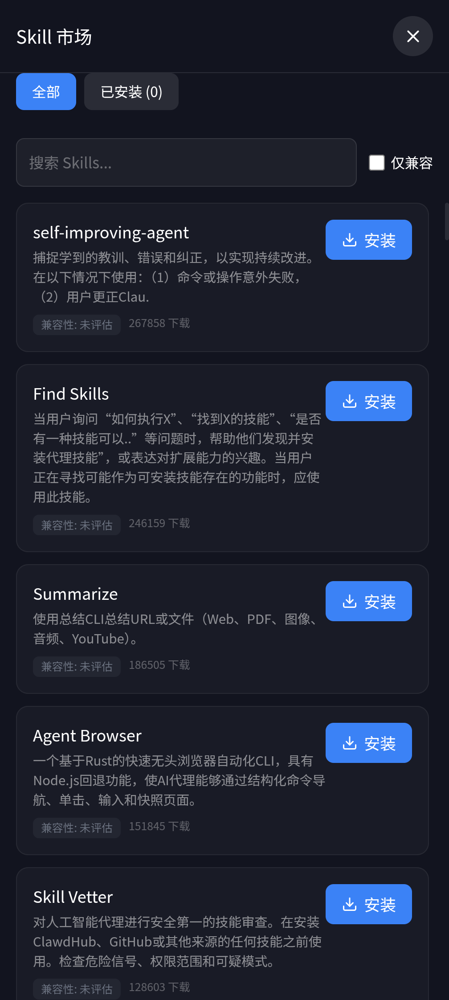

# ClawOS — AI-Native Mobile Operating System

> [English](README_EN.md)

ClawOS 是一个基于 AOSP 深度定制的实验性移动操作系统。核心理念：用户通过**自然语言**告诉 OS 自己的意图，底层操作由 LLM 驱动的 [OpenClaw](https://github.com/nicepkg/openclaw) 工具链完成，彻底改变传统触屏点击的交互方式。

## Features

- **自然语言交互** — 内嵌 OpenClaw Gateway，支持对话式操控设备
- **双 LLM 支持** — 云端 (Gemini / Claude / GPT) + 本地 (Ollama)，UI 一键切换
- **离线语音** — Sherpa-ONNX 引擎，设备端 STT (中英文) + TTS (中文)，无需联网
- **浏览器自动化** — 通过 CDP 协议控制内置 WebView，AI 可代替用户操作网页
- **中文输入** — 预装同文输入法 (Trime/RIME)，开箱即用，离线拼音输入
- **App Drawer** — 手势上划 + 按钮入口，搜索、半屏/全屏切换
- **Kiosk 模式** — ClawOS 作为唯一 Launcher，沉浸式全屏体验

## Screenshots

<table>
  <tr>
    <td align="center"><br/><b>主界面</b></td>
    <td align="center"><br/><b>模型配置</b></td>
    <td align="center"><br/><b>语音输入</b></td>
    <td align="center"><br/><b>AI 对话</b></td>
  </tr>
  <tr>
    <td align="center"><br/><b>IM 平台接入</b></td>
    <td align="center"><br/><b>应用列表</b></td>
    <td align="center"><br/><b>OTA 更新</b></td>
    <td align="center"><br/><b>Skill 市场</b></td>
  </tr>
</table>

## Architecture

```
┌─────────────────────────────────────────────────────┐
│                   ClawOS UI (React)                 │
│  Vite + TypeScript + Tailwind + Zustand + Three.js  │
├─────────────────────────────────────────────────────┤
│              Capacitor Native Bridge                │
│    ClawOSBridge (系统信息) │ ClawOSVoice (语音)     │
├─────────────────────────────────────────────────────┤
│              Android WebView Shell                  │
│  Launcher Activity │ BrowserActivity │ FloatingWin  │
├─────────────────────────────────────────────────────┤
│            OpenClaw Gateway (Node.js)               │
│     WebSocket RPC │ LLM Provider │ Tool Calling     │
├─────────────────────────────────────────────────────┤
│              AOSP Custom ROM                        │
│  init.clawos.rc │ SELinux Policy │ Boot Animation   │
└─────────────────────────────────────────────────────┘
```

## Download (预编译 ROM)

无需自行编译即可体验 ClawOS。在 SourceForge 下载预编译镜像：

**[SourceForge 下载页](https://sourceforge.net/projects/clawos/files/)**

| 文件 | 说明 | 适用 |
|------|------|------|
| [`pixel8pro/vX.X/system.img`](https://sourceforge.net/projects/clawos/files/pixel8pro/) | Pixel 8 Pro GSI 系统镜像 | 真机刷入 |
| [`pixel8pro/vX.X/vbmeta.img`](https://sourceforge.net/projects/clawos/files/pixel8pro/) | 禁用 AVB 验证的 vbmeta | 真机刷入 |
| [`emulator/vX.X/`](https://sourceforge.net/projects/clawos/files/emulator/) | 模拟器镜像 (ARM64) | Mac (Apple Silicon) 模拟器 |
| [`prebuilt/`](https://sourceforge.net/projects/clawos/files/prebuilt/) | Node.js ARM64 二进制 + Gateway bundle | 从源码构建时使用 |

## 快速体验 (预编译镜像)

### 方式 A: 真机刷入 (Pixel 8 Pro)

**前提**：Bootloader 已解锁、已安装 `adb` 和 `fastboot`。

1. 从 SourceForge 下载 `system.img` 和 `vbmeta.img`
2. 执行刷机：

**Mac / Linux:**

```bash
bash aosp/flash-pixel8pro-mac.sh
```

**Windows (PowerShell):**

```powershell
.\aosp\flash-pixel8pro-win.ps1        # 交互模式，逐步确认
.\aosp\flash-pixel8pro-win.ps1 -Auto  # 全自动模式
```

**手动刷机步骤：**

```bash
# 1. 进入 bootloader
adb reboot bootloader

# 2. 刷 vbmeta (禁用验证) — 在 bootloader 模式下
fastboot flash vbmeta_a vbmeta.img
fastboot flash vbmeta_b vbmeta.img

# 3. 切换到 fastbootd 刷 system (Pixel 8 Pro 是动态分区)
fastboot reboot fastboot
fastboot flash system system.img

# 4. 清除数据并重启
fastboot -w
fastboot reboot
```

> ⚠️ Pixel 8 Pro 注意事项：
> - `system.img` **必须**在 fastbootd 模式下刷入 (`fastboot reboot fastboot`)
> - `vbmeta.img` **必须**在 bootloader 模式下刷入
> - 首次刷入建议加 `-w` 清除数据

### 方式 B: 模拟器运行

> ⚠️ **架构限制**：AOSP 模拟器镜像为 ARM64 架构，**仅支持 ARM64 主机**：
> - ✅ Mac (Apple Silicon: M1/M2/M3/M4)
> - ✅ Windows ARM64 (如 Surface Pro X, 需启用 Hyper-V)
> - ❌ x86_64 Windows / Intel Mac 不支持 (无法高效运行 ARM64 镜像)

1. 从 SourceForge 下载模拟器镜像 zip
2. 安装 Android SDK (含 `emulator` 和 `platform-tools`)
3. 运行：

**Mac:**

```bash
bash aosp/run-emulator-mac.sh --images ~/Downloads/clawos-emulator
```

**Windows ARM64 (PowerShell):**

```powershell
.\aosp\run-emulator-win.ps1 -ImageDir "$env:USERPROFILE\Downloads\clawos-emulator"
```

## 从源码构建

### 环境要求

| 组件 | 要求 |
|------|------|
| **Linux 构建机** | Ubuntu 22.04+ x86_64, 16+ 核 CPU, 64+ GB RAM, 300+ GB SSD |
| **JDK** | OpenJDK 21 (Gradle 构建) |
| **Node.js** | 22+ LTS |
| **pnpm** | 10.x |
| **Android SDK** | API 31+ (构建 Capacitor APK) |
| **AOSP 源码** | ~200 GB 磁盘空间 |
| **Mac (可选)** | Apple Silicon, 用于运行 ARM64 模拟器 |
| **Windows (可选)** | ARM64 用于模拟器; x86_64 仅可拉取镜像 + 真机刷入 |

### 1. 克隆仓库 + 配置环境

```bash
git clone https://github.com/Lingxi-AI-cn/ClawOS.git
cd ClawOS

# 复制环境配置模板并修改
cp env.example aosp/.env.local
# 编辑 aosp/.env.local，设置 LINUX_USER, LINUX_HOST 等
```

### 2. UI 开发 (仅前端，不需要 AOSP)

```bash
cd ui
pnpm install
pnpm run dev    # 启动 Vite 开发服务器，浏览器访问 http://localhost:5173
```

需要连接 Gateway 才能使用 AI 对话功能。详见 [OpenClaw 文档](https://github.com/nicepkg/openclaw)。

### 3. 构建 Android APK

```bash
cd ui
pnpm run build
npx cap sync android

export JAVA_HOME=$JAVA_HOME    # 来自 .env.local
cd android
./gradlew assembleDebug

# APK 产物: app/build/outputs/apk/debug/app-debug.apk
```

### 4. 构建 ROM

需要先完成 AOSP 源码同步，详见 [AOSP 构建指南](aosp/GUIDE.md)。

**一键构建：**

```bash
bash build-rom.sh
```

**或分步执行：**

```bash
# Step 1: 构建 APK (见上方)
# Step 2: 同步设备树
bash aosp/scripts/05-setup-device-tree.sh

# Step 3: AOSP 编译 (GSI, Android 16)
cd /opt/aosp
source build/envsetup.sh
lunch clawos_gsi_arm64-trunk_staging-userdebug
m -j$(nproc)

# 产物: out/target/product/clawos_gsi_arm64/system.img
```

### 5. 拉取镜像到本机

**Mac:**

```bash
bash aosp/pull-pixel8pro-images-mac.sh        # Pixel 8 Pro 镜像
bash aosp/run-emulator-mac.sh --pull --clean   # 模拟器镜像
```

**Windows (PowerShell):**

```powershell
.\aosp\pull-pixel8pro-images-win.ps1           # Pixel 8 Pro 镜像
.\aosp\run-emulator-win.ps1 -Pull -Clean       # 模拟器镜像 (仅 ARM64 Windows)
```

### 6. 发布到 SourceForge

```bash
bash aosp/scripts/upload-sourceforge.sh v1.0 --all
```

## Project Structure

```
ClawOS/
├── ui/                          # 主 UI 应用
│   ├── src/                     # React + TypeScript 源码
│   │   ├── components/          # UI 组件 (ChatPanel, InputBar, HUD, AppDrawer...)
│   │   ├── gateway/             # Gateway WebSocket 客户端 + 平台桥接
│   │   ├── voice/               # 语音模块 (STT/TTS Capacitor 插件)
│   │   ├── store/               # Zustand 状态管理
│   │   └── scene/               # 3D 场景 (Three.js)
│   ├── android/                 # Capacitor Android 项目
│   │   └── app/src/main/java/   # Native 插件 (ClawOSBridge, ClawOSVoice)
│   └── electron/                # Electron 桌面壳层
├── aosp/                        # AOSP 构建脚本和设备树
│   ├── device/clawos/           # ClawOS 设备树 (产品定义、init 服务、SELinux)
│   │   ├── gateway/             # OpenClaw Gateway 配置和启动脚本
│   │   ├── init/                # Android init 服务定义
│   │   ├── overlay/             # 系统框架资源覆盖
│   │   └── sepolicy/            # SELinux 策略
│   ├── scripts/                 # 构建脚本 (01-环境 → 05-同步设备树)
│   ├── run-emulator-mac.sh      # Mac 模拟器运行脚本
│   ├── run-emulator-win.ps1     # Windows 模拟器运行脚本
│   ├── flash-pixel8pro-mac.sh   # Mac Pixel 8 Pro 刷机脚本
│   ├── flash-pixel8pro-win.ps1  # Windows Pixel 8 Pro 刷机脚本
│   └── GUIDE.md                 # AOSP 构建完整指南
├── build/                       # 桌面版部署脚本
├── env.example                  # 环境变量模板
├── build-rom.sh                 # 一键 ROM 构建脚本
└── CLAUDE.md                    # AI 助手项目上下文
```

## Tech Stack

| 层级 | 技术 |
|------|------|
| **前端 UI** | React 19 · TypeScript 5.9 · Vite 7 · Tailwind CSS 4 · Zustand 5 · Three.js |
| **移动壳层** | Capacitor 7 · Android WebView · Custom Capacitor Plugins |
| **语音引擎** | Sherpa-ONNX · Silero VAD · Streaming Zipformer STT · Matcha TTS |
| **AI 后端** | OpenClaw Gateway · Node.js 22 · WebSocket RPC Protocol v3 |
| **LLM** | Gemini Flash (云端) · Claude (云端) · Ollama (本地) |
| **输入法** | Trime (同文输入法) · RIME 引擎 · 拼音简化方案 |
| **OS 基础** | AOSP 16 (Pixel 真机 GSI) |
| **桌面平台** | Electron 40 · Ubuntu 24.04 Kiosk |

## 外部依赖 (从源码构建时需要)

以下大文件不在 Git 仓库中。可从 SourceForge [prebuilt/](https://sourceforge.net/projects/clawos/files/prebuilt/) 下载，或手动获取：

| 文件 | 大小 | 获取方式 |
|------|------|----------|
| `ui/android/app/libs/sherpa-onnx.aar` | ~38 MB | [Sherpa-ONNX Releases](https://github.com/k2-fsa/sherpa-onnx/releases) |
| `aosp/device/clawos/models/` | ~123 MB | [Hugging Face](https://huggingface.co/csukuangfj) (STT/TTS/VAD 模型) |
| `aosp/device/clawos/prebuilt/node` | ~68 MB | SourceForge prebuilt 或交叉编译 |
| `aosp/device/clawos/gateway/gateway-bundle.tar.gz` | ~67 MB | SourceForge prebuilt 或 `npm pack openclaw` |
| `aosp/device/clawos/apps/ClawOS.apk` | ~108 MB | 构建生成 (Step 3) |

## 已验证设备

| 设备 | SoC | Android | 状态 |
|------|-----|---------|------|
| Google Pixel 8 Pro | Tensor G3 | 16 (GSI) | ✅ 完全可用 |
| Lenovo Tab M10 FHD Plus | MT8768 | 12 (GSI) | ✅ 可用 |
| AOSP 模拟器 (Mac ARM64) | Virtual | 16 | ✅ 可用 |

## License

Copyright 2026 Lingxi AI

Licensed under the Apache License, Version 2.0. See [LICENSE](LICENSE) for details.
